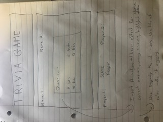

# projectProposal
What game will I create? 
Trivia Game

### Technologies used:
javascript
html
css

### Approach taken:
Game Choice - Trivia Game
PsuedoCode Instructions

## Rules of the game

Answer as many questions as you can correctly. Player with the most questions right wins.

## Technical Challenges

- How do i alternate between turns?
- how do i log the results? 
- how to reset game?

## Wireframe

## Timeline*
1. Tuesday (today)- proposal / start html javascript css pages
2. Wednesday - create question and answer layout/ use buttons for multiple choice
3. Thursday - javascript for right/wrong answer animation
4. Friday - javascript for keeping score, alternating between players, resetting
5. Saturday - javascript use of dom manipulation
6. Sunday - javascript/css
7. Monday - polishing

*In a perfect world! lol