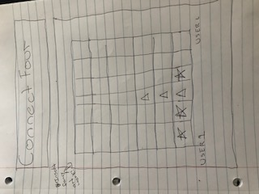

# projectProposal
What game will I create? 
Connect Four

### Technologies used:
javascript
html
css

### Approach taken:
Game Choice - Connect Four
PsuedoCode Instructions

## Rules of the game

Try to build a row or column of four tokens before your opponent.

## Technical Challenges

- Build game board using grid?!
- How do i alternate between turns?
- Onclick method to drop tokens?
- get icons from online icon directory?

## Wireframe
