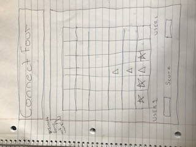

# projectProposal
What game will I create? 
Connect Four

### Technologies used:
javascript
html
css

### Approach taken:
Game Choice - Connect Four
PsuedoCode Instructions

## Rules of the game

Try to build a row or column of four tokens before your opponent.

## Technical Challenges

- Build game board using grid?!
- How do i alternate between turns?
- Onclick method to drop tokens?
- get icons from online icon directory?
- how do i log the results? 
- how to reset game?

## Wireframe

## Timeline*
1. Tuesday (today)- proposal / start html javascript css pages
2. Wednesday - use grid to create gameboard and webpage layout/ javascript
3. Thursday - javascript
4. Friday - javascript
5. Saturday - javascript
6. Sunday - javascript/css
7. Monday - polishing

*In a perfect world! lol